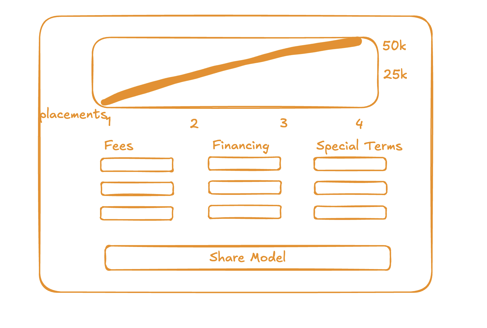

# 📝 Contract Negotiation Tool by Silver.dev

## Introduction

Every agency needs to negotiate with a prospective client. Discussing mathematical formulas with language is awkward, and the email back and forth is lengthy and uncomfortable.

We want to build a tool that makes it easier and more formal to communicate a negotiation, one in which each party's interests are best represented for maximum utility.

## Objectives

- Create a tool that models and expresses contract value more accurately than pure intuition
- Create a tool that improves negotiations between clients and agencies

## Goals

- Create a single-page tool that allows any anonymous user to gauge contract value
- [Stretch] Automatize tool → actual contract creation

### Design



- There are multiple features to consider for the model:
  - Financials (deferred payment, pure contingency/retainer, financing, credit card processing)
  - Discounts for volume, promotions
  - Exclusivity discounts
- Example prompt: <https://chatgpt.com/share/67bdc5f6-4ce8-800e-aa11-5641c80418ac>

## Getting Started

First, run the development server:

```bash
npm run dev
# or
yarn dev
# or
pnpm dev
# or
bun dev
```

Open [http://localhost:3000](http://localhost:3000) with your browser to see the result.

You can start editing the page by modifying `app/page.tsx`. The page auto-updates as you edit the file.

This project uses [`next/font`](https://nextjs.org/docs/app/building-your-application/optimizing/fonts) to automatically optimize and load [Geist](https://vercel.com/font), a new font family for Vercel.

## Learn More

To learn more about Next.js, take a look at the following resources:

- [Next.js Documentation](https://nextjs.org/docs) - learn about Next.js features and API.
- [Learn Next.js](https://nextjs.org/learn) - an interactive Next.js tutorial.

You can check out [the Next.js GitHub repository](https://github.com/vercel/next.js) - your feedback and contributions are welcome!

## Deploy on Vercel

The easiest way to deploy your Next.js app is to use the [Vercel Platform](https://vercel.com/new?utm_medium=default-template&filter=next.js&utm_source=create-next-app&utm_campaign=create-next-app-readme) from the creators of Next.js.

Check out our [Next.js deployment documentation](https://nextjs.org/docs/app/building-your-application/deploying) for more details.
